## Προσαρμοσμένοι τύποι αντί για primitives
(package com.steft.travel_app.common)

Οι προσαρμοσμένοι τύποι που δημιουργήθηκαν επιτελούν τους παρακάτω σκοπούς:
* Ενισχύουν την μοντελοποίηση των δεδομένων.
* Εξασφαλίζουν την εγκυρότητα της δομής των δεδομένων με τρόπο που δεν μπορούν να εγγυηθούν οι primitives.
* Επιβάλλουν τον χειρισμό των περιπτώσεων όπου τα δεδομένα δεν έχουν την μορφή που θα έπρεπε

Για την επιβεβαίωση της εγκυρότητας των δεδομένων, αλλά και για τον χειρισμό των περιπτώσεων μη εγκυρότητας, χρησιμοποιήθηκε ο τύπος δεδομένων `Validated` από την βιβλιοθήκη [arrow](https://arrow-kt.io/docs/apidocs/arrow-core/arrow.core/-validated/)

*Σημείωση: στον ακόλουθο κώδικα χρησιμοποιούνται τα παρακάτω από το αρχείο Validated.kt:*
```kotlin
data class ValidationError(val message: String)

typealias ValidatedObject<T> = ValidatedNel<ValidationError, T>

```

### Email
```kotlin
class Email private constructor(private val emailString: String) {
    
    ... //omitted

    companion object {
        private val validEmailPattern =
            Pattern.compile("...") //omitted

        fun makeValidated(emailString: String): ValidatedObject<Email> {
          ... //omitted
        }
    }
}
```
Επιτρέπει την ύπαρξη τιμών τύπου `Email` μόνο εφόσον είναι έγκυρες διευθύνσεις και επιβάλλει την διαχείριση των περιπτώσεων που η διεύθυνση που έχει δοθεί δεν ήταν έγκυρη.

### Phone
```kotlin
class Phone private constructor(private val phoneString: String) {

    companion object {
        private val validPhonePattern =
            Pattern.compile(...) //omitted

        fun makeValidated(phoneString: String): ValidatedObject<Phone> {
          ...//omitted
        }
    }
```
Επιτρέπει την ύπαρξη τιμών τύπου `Phone` μόνο εφόσον είναι έγκυρες και επιβάλλει την διαχείριση των περιπτώσεων που το τηλεφωνικό νούμερο που έχει δοθεί δεν ήταν έγκυρο. Υποστηρίζει κωδικούς χώρας και διαχωριστικά μεταξύ ομάδων αριθμών.

### Username
```kotlin
class Username(val string: String)
```
Ενισχύει την σημασιολογία των τιμών που αναπαριστούν usernames.

### SHA256
```kotlin
class Sha256(val string: String) {
    companion object {
        fun makeSalted(string: String): Sha256 {
          ...//omitted
        }

        fun makeSalted(string: String, salt: String) {
          ...//omitted
        }

        fun split(sha: Sha256): Pair<String, String> {
          ...//omitted
        }
    }
}
```
Αναπαριστά κρυπτογραφημένες τιμές και προσφέρει συναρτήσεις για την δημιουργία και την διαχείριση τους.

### Name
```kotlin
class Name private constructor(private val nameString: String) {
    override fun toString() = nameString

    companion object {
        private val validAddressPattern =
            Pattern.compile(...) //omitted

        fun makeValidated(nameString: String): ValidatedObject<Name> {
            ... //omitted
        }

        fun content(name: Name): String {
          ... //omitted
        }
    }
}
```
Επιτρέπει την ύπαρξη τιμών τύπου `Name` μόνο εφόσον είναι έγκυρες και επιβάλλει την διαχείριση των περιπτώσεων που η ονομασία που έχει δοθεί δεν ήταν έγκυρη. Μία έγκυρη ονομασία είναι ορισμένη ως μία αλφαριθμητική τιμή που αποτελείται μόνο από γράμματα και κενά.

### LocationType
```kotlin
enum class LocationType {
    Cruise,
    Roadtrip,
    Independent
}
```
Περιγράφει τα τρία διαφορετικά είδη εκδρομής.

### Converters
Για την αποθήκευση μοντέλων με προσαρμοσμένους τύπους στην Sqlite δημιουργήθηκαν type converters όπως απαιτείται από το Room API, στο αρχείο `Converters.kt`.

## Μοντέλα
(package: com.steft.travel_app.model)

Τα μοντέλα αναπαριστούν τα δεδομένα όπως αποθηκεύονται στις βάσεις (Sqlite και Firestore).

### Location (Προορισμός) - Sqlite
```kotlin
@Entity(
    tableName = "location",
    indices = [Index(value = ["city", "country"])],
    foreignKeys = [
        ForeignKey(
            entity = TravelAgency::class,
            parentColumns = ["id"],
            childColumns = ["travel_agency"],
            onDelete = ForeignKey.RESTRICT)])
data class Location(
    @PrimaryKey val id: UUID = UUID.randomUUID(),
    @ColumnInfo(name = "travel_agency")val travelAgency: UUID?,
    val city: Name,
    val country: Name)
```
Ο προορισμός αποτελεί μια διακριτή περιοχή στον κόσμο, στην οποία μπορούν τα ταξιδιωτικά γραφεία να προσφέρουν εκδρομές. Τον χαρακτηρίζουν 4 πεδία:
* `id: UUID` - Η μοναδική ταυτότητα της εγγραφής, τύπου `UUID` (Universal Unique Identifier).
* `travelAgency: UUID` - Ξένο κλειδί προς μία εγγραφή του πίνακα `travel_agency`. Το πεδίο είναι nullable, όπως προσδιορίζει το Αγγλικό ερωτηματικό. Η ύπαρξη αυτού του πεδίου σε μια εγγραφή προσδιορίζει πως ο συγκεκριμένος προορισμός δημιουργήθηκε από ένα ταξιδιωτικό γραφείο και δεν είναι διαθέσιμος σε όλα (εκτός φυσικά αν δημιουργήσουν τα ίδια έναν αντίστοιχο δικό τους).
* `city: Name` - Το όνομα της πόλης του προορισμού, τύπου `Name`.
* `country: Name` - Το όνομα της πόλης του προορισμού, τύπου `Name`.

### TravelAgency (Ταξιδιωτικό Γραφείο) - Sqlite
```kotlin
@Entity(
    tableName = "travel_agency",
    indices = [Index(
        value = ["username"],
        unique = true)])
data class TravelAgency(
    @PrimaryKey val id: UUID = UUID.randomUUID(),
    val name: Name,
    val address: Address,
    val username: Username,
    val password: Sha256)
```
Αναπαριστά ένα ταξιδιωτικό γραφείο που χρησιμοποιεί την εφαρμογή μέσω ενός μοναδικού χρήστη, προσδιοριζόμενος από username/password, για να δημιουργεί και να διαχειρίζεται αγγελίες εκδρομών που διαθέτει. Το χαρακτηρίζουν 5 πεδία:
* `id: UUID` - Η μοναδική ταυτότητα της εγγραφής, τύπου `UUID` (Universal Unique Identifier).
* `name: Name` - Το όνομα του ταξιδιωτικού γραφείου, τύπου `Name`.
* `address: Address` - Η διεύθυνση του ταξιδιωτικού γραφείου, τύπου `Address`.
* `username: Userame` - Το μοναδικό όνομα χρήστη, τύπου `Username`.
* `password: Password` - Ο κρυπτογραφημένος με SHA256 κρυπτογράφηση κωδικός του χρήστη.

### Bundle (Πακέτο) - Sqlite
```kotlin
@Entity(
    tableName = "bundle",
    foreignKeys = [
        ForeignKey(
            entity = TravelAgency::class,
            parentColumns = ["id"],
            childColumns = ["travel_agency"],
            onDelete = ForeignKey.RESTRICT),
        ForeignKey(
            entity = Location::class,
            parentColumns = ["id"],
            childColumns = ["location"],
            onDelete = ForeignKey.RESTRICT)])
data class Bundle(
    @PrimaryKey val id: UUID = UUID.randomUUID(),
    @ColumnInfo(name = "travel_agency") val travelAgency: UUID,
    val location: UUID,
    val date: Date,
    val price: Double,
    val duration: Int,
    val hotels: List<Name>,
    val type: LocationType)
```
Αναπαριστά ένα πακέτο που προσφέρει ένα ταξιδιωτικό γραφείο σε μία περιοχή, για ένα χρονικό διάστημα, με μία συγκεκριμένη τιμή και προτεινόμενα ξενοδοχεία. Το χαρακτηρίζουν 8 πεδία:
* `id: UUID` - Η μοναδική ταυτότητα της εγγραφής, τύπου `UUID` (Universal Unique Identifier).
* `travelAgency: UUID` - Ξένο κλειδί προς μία εγγραφή του πίνακα `travel_agency`. Προσδιορίζει το ταξιδιωτικό γραφείο που προσφέρει αυτό το πακέτο.
* `location: UUID` - Ξένο κλειδί προς μία εγγραφή του πίνακα `location`. Προσδιορίζει τον προορισμό στον οποίο αναφέρεται το πακέτο.
* `date: Date` - Η ημερομηνία έναρξης της εκδρομής, τύπου `Date`.
* `price: Double` - Η τιμή του πακέτου, τύπου `Double`.
* `hotels: List<Name>` - Μία λίστα με τα προτεινόμενα ξενοδοχεία του ταξιδιωτικού γραφείου στην περιοχή της εκδρομής, τύπου `List<Name>`.
* `type: LocationType` - Το είδος της εκδρομής, τύπου `LocationType`.

### Registrations (Εγγραφές) - Firestore
```kotlin
data class CustomerDetails(
    val name: Name,
    val surname: Name,
    val phone: Phone,
    val email: Email,
    val hotel: String)

data class Registrations(
    val bundle: UUID,
    val travelAgency: UUID,
    val customers: List<CustomerDetails>)
```
Αναπαριστά το σύνολο των εγγραφών που έχουν γίνει για ένα πακέτο ενός ταξιδιωτικού γραφείου. Κάθε εγγραφή χαρακτηρίζεται από:
* `name: Name` - Το όνομα του πελάτη, τύπου `Name`.
* `surname: Name` - Το επίθετο του πελάτη, τύπου `Name`.
* `phone: Phone` - Το τηλέφωνο επικοινωνίας που δήλωσε ο πελάτης, τύπου `Phone`.
* `email: Email` - Η διεύθυνση ηλεκτρονικού ταχυδρομείου επικοινωνίας που δήλωσε ο πελάτης, τύπου `Email`.
* `hotel: String` - Το ξενοδοχείο που επέλεξε ο πελάτης (όχι απαραίτητα ένα από τα προτεινόμενα του πακέτου), τύπου `String`.

## Daos και αρχικοποίηση των βάσεων
(package com.steft.travel_app.dao)

Για κάθε ένα από τα μοντέλα, δημιουργήθηκε ένα αντίστοιχο Dao με τις μεθόδους ανάκτησης και τροποποίησης της βάσης που απαιτούνται από την εφαρμογή.

### BundleDao
```kotlin
@Dao
interface BundleDao {
    @Query("SELECT * FROM bundle")
    suspend fun getAll(): List<Bundle>
```
```kotlin
    @Query(
        """
        SELECT * FROM bundle"+
        WHERE travel_agency = :travelAgency
        """)
    suspend fun findByTravelAgency(travelAgency: UUID): List<Bundle>
```
```kotlin
    @Query(
        """
        SELECT * FROM bundle 
        WHERE location = :locationId
        """)
    suspend fun findByLocation(locationId: UUID): List<Bundle>
```
```kotlin
    @Query(
        """
        SELECT * FROM bundle 
        WHERE id = :id
        """)
    suspend fun findById(id: UUID): Bundle?
```
```kotlin
    @Insert
    suspend fun insertAll(vararg bundles: Bundle)
```
```kotlin
    @Update
    suspend fun update(bundle: Bundle)
```
```kotlin
    @Query(
        """
           DELETE FROM bundle 
           WHERE id = :id 
           AND travel_agency = :travelAgency
        """)
    suspend fun delete(id: UUID, travelAgency: UUID): Int
}
```
* `getAll()` - Επιστρέφει όλα τα πακέτα της βάσης.
* `findByTravelAgency(travelAgency: UUID)` - Επιστρέφει όλα τα πακέτα ενός ταξιδιωτικού γραφείου.
* `findByLocation(locationId: UUID)` - Επιστρέφει όλα τα πακέτα που προσφέρονται για έναν προορισμό.
* `findById(id: UUID)` - Επιστρέφει το μοναδικό πακέτο που αντιστοιχεί στο `id`, εφόσων υπάρχει.
* `insertAll(vararg bundles: Bundle)` - Προσθέτει στην βάση όλα τα `bundles`.
* `update(bundle: Bundle)` - Ενημερώνει ένα πακέτο της βάσης με βάση το `bundle`.
* `delete(id: UUID, travelAgency: UUID)` - Διαγράφει το μοναδικό πακέτο που αντιστοιχεί στο `id`, εφόσων ανήκει στο ταξιδιωτικό γραφείο που αντιστοιχεί το `travelAgency`.

### LocationDao
```kotlin
@Dao
interface LocationDao {
    @Query("SELECT * FROM location")
    suspend fun getAll(): List<Location>
```
```kotlin
    @Query(
           """
           SELECT * FROM location 
           WHERE travel_agency = :travelAgency 
           OR travel_agency IS NULL
           """
    )
    suspend fun findAllOfAgency(travelAgency: UUID): List<Location>
```
```kotlin
    @Query(
        """
        SELECT * FROM location 
        WHERE id = :id
        """)
    suspend fun findById(id: UUID): Location?
```
```kotlin
    @Query(
        """
        SELECT * FROM location 
        WHERE city LIKE '%' || :query || '%' 
        OR country LIKE '%' || :query || '%'
        AND travel_agency = :travelAgency
        OR travel_agency IS NULL
        """)
    suspend fun searchOfAgency(query: String, travelAgency: UUID)
            : List<Location>
```
```kotlin
    @Query(
        """
        SELECT * FROM location 
        WHERE city LIKE '%' || :query || '%' 
        OR country LIKE '%' || :query || '%'
        """)
    suspend fun searchAll(query: String): List<Location>
```
```kotlin
    @Insert
    suspend fun insertAll(vararg locations: Location)
```
```kotlin
    @Query(
        """
        DELETE FROM location 
        WHERE id = :id 
        AND travel_agency = :travelAgencyId
        """)
    suspend fun deleteCustom(id: UUID, travelAgencyId: UUID): Int
```
```kotlin
    @Query(
        """
        SELECT * FROM location WHERE id = (
            SELECT location FROM bundle WHERE id = :bundleId
        )
        """)
    suspend fun findFromBundleId(bundleId: UUID): Location?
}
```
* `getAll()` - Επιστρέφει όλους τους προορισμούς της βάσης
* `findAllOfAgency(travelAgency: UUID)` - Επιστρέφει όλους τους προορισμούς στους οποίους έχει πρόσβαση ένας χρήστης ταξιδιωτικού γραφείου (δηλαδή στους προυπάρχοντες και σε αυτούς που δημιούργησε).
* `findById(id: UUID)` - Επιστρέφει τον μοναδικό προορισμό που αντιστοιχεί στο `id`, εφόσων υπάρχει.
* `searchOfAgency(query: String, travelAgency: UUID)` - Επιστρέφει όλους τους προορισμούς με βάση την αναζήτηση της χώρας ή της πόλης `query`, στους οποιους έχει πρόσβαση ο χρήστης ταξιδιωτικού γραφείου που αναγνωρίζεται με `id`.
* `searchAll(query: String)` - Επιστρέφει όλους τους προορισμούς με βάση την αναζήτηση της χώρας ή της πόλης `query`.
* `insertAll(vararg locations: Location)` - Προσθέτει στην βάση όλα τα `locations`
* `deleteCustom(id: UUID, travelAgencyId: UUID)` - Διαγράφει τον προορισμό που αντιστοιχεί στο `id`, εφόσον έχει δημιουργηθεί από τον χρήστη του ταξιδιωτικού γραφείου που αντιστοιχεί στο `travelAgencyId`.
* `findFromBundleId(bundleId: UUID)` - Βρίσκει τον προορισμό που έχει δηλωθεί στο πακέτο που αντιστοιχεί στο `bundleid`, εφόσον υπάρχει.

### RegistrationDao
```kotlin
interface RegistrationDao {
    suspend fun getAll(bundle: UUID): List<Registrations>

    suspend fun insert(vararg registrations: Registrations)

    suspend fun register(
        bundle: UUID, 
        vararg customers: CustomerDetails)

    suspend fun findByAgencyId(travelAgency: UUID): List<Registrations>

    suspend fun registrationsExist(bundle: UUID): Boolean
}

private class RegistrationDaoImpl(private val db: FirebaseFirestore) 
  : RegistrationDao {
  ... //omitted
}

fun FirebaseFirestore.registrationDao(): RegistrationDao =
    RegistrationDaoImpl(this)
```


Απευθύνεται στην Firestore, οπότε οι μέθοδοι έπρεπε να υλοποιηθούν από εμάς. Βρίσκονται στην private class `RegistrationDaoImpl`. Ενα Dao τυπου `RegistrationDao` μπορεί να ανακτηθεί από την συνάρτηση `FirebaseFirestore.registrationDao()`.
* `getAll(bundle: UUID)` - Επιστρέφει όλες τις εγγραφές που έχουν αναρτηθεί για το bundle που αντιστοιχεί στο `bundleId`.
* `insert(vararg registrations: Registrations)` - Καταχωρεί όλες τις εγγραφές `registrations` στην βάση.
* `register(bundle: UUID, vararg customers: CustomerDetails)` - Αναρτεί ένα σύνολο εγγραφών στο πακέτο που αντιστοιχεί στο `bundle`.
* `findByAgencyId(travelAgency: UUID)` - Επιστρέφει όλες τις εγγραφές που έχουν γίνει σε πακέτα του ταξιδιωτικού γραφείου που αντιστοιχεί στο `travelAgency`.
* `registrationsExist(bundle: UUID)` - Επιστρέφει `true` εφόσων υπάρχουν εγγραφές στο πακέτο που αντιχτοιχεί στο `bundle`. Αλλιώς, επιστρέφει `false`.

#### TravelAgencyDao
```kotlin
@Dao
interface TravelAgencyDao {
    @Query("SELECT * FROM travel_agency")
    suspend fun getAll(): List<TravelAgency>
```
```kotlin
    @Query("SELECT * FROM travel_agency WHERE id = :id")
    suspend fun findById(id: UUID): TravelAgency?
```
```kotlin
    @Query("SELECT * FROM travel_agency WHERE username = :username")
    suspend fun findByUsername(username: Username): TravelAgency?
```
```kotlin
    @Insert
    suspend fun insertAll(vararg agencies: TravelAgency)
```
```kotlin
    @Query("DELETE FROM travel_agency WHERE id = :id")
    suspend fun delete(id: UUID): Int
}
```
* `getAll()` - Επιστρέφει όλα τα ταξιδιωτικά γραφεία της βάσης.
* `findById(id: UUID)` - Επιστρέφει το ταξιδιωτικό γραφείο που αντιστοιχεί στο `id`, εφόσον υπάρχει.
* `findByUsername(username: Username)` - Επιστρέφει το ταξιδιώτικο γραφείο με όνομα χρήστη `username`, εφόσον υπάρχει.
* `insertAll(vararg agencies: TravelAgency)` - Προσθέτει στην βάση όλα τα ταξιδιωτικά γραφεία `agencies`.
* `delete(id: UUID)` - Διαγράφει το ταξιδιωτικό γραφείο που αντιστοιχεί στο `id`

### Αρχικοποίηση βάσεων
Η Sqlite αρχικοποιείται μέσω της συνάρτησης `getDatabase` χρησιμοποιώντας Singleton Pattern ώστε να μη δεσμεύονται πάνω από μία ταυτόχρονες συνδέσεις προς την βάση. Επίσης εφόσον αρχικοποιηθεί για πρώτη φορά, θα βασιστεί στην εικόνα βάσης του αρχείου `assets/database/travel_app`
```kotlin
@Database(
    entities = [
        TravelAgency::class,
        Location::class,
        Bundle::class],
    version = 1)
@TypeConverters(Converters::class)
abstract class AppDatabase : RoomDatabase() {
    abstract fun travelAgencyDao(): TravelAgencyDao
    abstract fun locationDao(): LocationDao
    abstract fun bundleDao(): BundleDao

    companion object {
        private var instance: AppDatabase? = null
        fun getDatabase(context: Context): AppDatabase { 
          ... //omitted
        }
    }
}
```

Το client library της firestore υλοποιεί εσωτερικά Singleton Pattern, άρα δεν απαιτείται κάποια επιπλέον δράση.
```kotlin
fun firebaseDb() = Firebase.firestore
```
## Exceptions
(package com.steft.travel_app.common)

```kotlin
private fun derivedExceptionMessage(exception: Throwable) = "Original exception $exception"


data class InvalidObjectException(override val message: String) : Exception(message) {
    companion object {
        fun fromOtherException(exception: Throwable) =
            InvalidObjectException(derivedExceptionMessage(exception))
    }
}

data class CorruptDatabaseObjectException(override val message: String) : Exception(message) {
    companion object {
        fun fromOtherException(exception: Throwable) =
            CorruptDatabaseObjectException(derivedExceptionMessage(exception))
    }
}

data class UnauthorizedException(override val message: String) : Exception(message) {
    companion object {
        fun fromOtherException(exception: Throwable) =
            UnauthorizedException(derivedExceptionMessage(exception))
    }
}
```
Δημιουργήθηκαν 3 Exceptions για την μοντελοποίηση λαθών κατά την εκτέλεση της εφαρμογής.
* `InvalidObjectException` - Δόθηκε μία μη έγκυρη τιμή.
* `CorruptDatabaseObjectException` - Μία τιμή που επιστράφηκε από την βάση δεν ήταν έγκυρης δομής.
* `UnauthorizedException` - Αυτή η λειτουργικότητα δεν επιτρέπεται στον χρήστη.

## DTOs
(package com.stef.travel_app.dto)

Για την διευκόλυνση του χειρισμού και προβολής των δεδομένων όταν έχουν ξεπεραστεί οι περιπτώσεις μη εγκυρότητας ή όταν έχουν λήξει οι απαιτήσεις ενίσχυσης σημασιολογίας, δημιουργήθηκαν DTOs (Data Transfer Objects) για κάθε μοντέλο. Αυτά χωρίζονται σε δύο κατηγορίες:
* Preview DTOs - DTOs που υλοποιούν το παρακάτω interface `Preview`. Προσφέρουν την δυνατότητα προβολής τους σε ένα κοινό `RecyclerView` component, αφού έχουν την ίδια ακριβώς δομή.
  ```kotlin
  interface Preview {
      val id: UUID
      val title: String
      val details: String
  }
  ```
* Απλά DTOs - DTOs που καθρεπτίζουν την δομή των μοντέλων που αναπαριστούν, αλλά χωρίς προσαρμοσμένους τύπους.


```kotlin
data class BundleDto(
    val id: UUID,
    val travelAgency: String,
    val location: UUID,
    val date: String,
    val price: Double,
    val duration: Int,
    val hotels: List<String>,
    val type: String
)

data class BundlePreviewDto(
    override val id: UUID,
    override val title: String,
    override val details: String
) : Preview

data class LocationDto(
    val id: UUID,
    val travelAgency: UUID?,
    val city: String,
    val country: String
)

data class LocationPreviewDto(
    override val id: UUID,
    override val title: String,
    override val details: String
) : Preview

data class CustomerDetailsDto(
    val name: String,
    val surname: String,
    val phone: String,
    val email: String,
    val hotel: String
)

data class RegistrationsDto(
    val bundle: UUID,
    val customers: List<CustomerDetailsDto>
)

data class RegistrationsPreviewDto(
    override val id: UUID,
    override val title: String,
    override val details: String
) : Preview

data class TravelAgencyDto(
    val id: UUID,
    val name: String,
    val address: String,
    val username: String
)
```

## ViewModels
(package com.steft.travel_app.viewmodel)

Για την σύνδεση μεταξύ των βάσεων και της διεπαφής, για την εκτέλεση ασύγχρονων διαδικασιών, για την μετατροπή από τα μοντέλα στα αντίστοιχα DTOs, για την διαχείριση μη έγκυρων δεδομένων και για την διατήρηση των δεδομένων ώστε να επιβιώνουν αλλαγές configuration (όπως αλλαγή από portrait σε landscape mode), δημιουργήθηκαν δύο ViewModels.

### LoginRegisterViewModel
```kotlin
class LoginRegisterViewModel(application: Application) : AndroidViewModel(application) {
    
    ... //omitted

    fun login(
        username: String, 
        password: String): LiveData<UUID?> {
          ... //omitted
        }


    fun register(
        name: String, 
        address: String, 
        username: String, 
        password: String): LiveData<Boolean> {
          ... //omitted
        }
```
Προσφέρει λειτουργικότητα εγγραφής και αυθεντικοποίησης ενός χρήστη ταξιδιωτικού γραφείου.
* `login(username: String, password: String)` - Αυθεντικοποιεί έναν χρήστη ταξιδιωτικού γραφείου.
* `register(name: String, address: String, username: String, password: String)` - Επιβεβαιώνει την εγκυρότητα δομής του username και password, κρυπτογραφεί το password και προσθέτει τον χρήστη στη βάση.

### MainViewModel
Προσφέρει τις κύριες λειτουργικότητες που απαιτεί η εφαρμογή

```kotlin
private typealias LiveList<A> = LiveData<List<A>>

class MainViewModel(
    application: Application, 
    val travelAgency: UUID?) : AndroidViewModel(application) {

      ... //omitted

    fun isLoggedIn() {
      ... //omitted
    }

    fun getUserId() { 
      ... //omitted
    }

    fun getTravelAgency(): LiveData<TravelAgencyDto?> {
      ... //omitted
    }


    fun getLocation(locationId: UUID): LiveData<LocationDto?> {
      ... //omitted
    }

    fun getLocations(): LiveList<LocationPreviewDto> {
      ... //omitted
    }

    fun getAgencyLocations(): LiveList<LocationPreviewDto> {
      ... //omitted
    }

    fun addCustomLocation(
        city: String,
        country: String): LiveData<Boolean> {
      ... //omitted
    }

    fun deleteCustomLocation(id: UUID): LiveData<Boolean> {
      ... //omitted
    }

    fun getBundle(bundleId: UUID): LiveData<BundleDto?> {
      ... //omitted
    }

    fun getBundles(): LiveList<BundlePreviewDto> {
      ... //omitted
    }

    fun getBundles(locationId: UUID): LiveList<BundlePreviewDto> {
      ... //omitted
    }

    fun getAgencyBundles(): LiveList<BundlePreviewDto> {
      ... //omitted
    }

    fun addBundle(
        locationId: UUID,
        date: Date,
        price: Double,
        duration: Int,
        hotels: List<String>,
        type: LocationType): LiveData<Boolean> {
      ... //omitted
    }

    fun updateBundle(
        bundleId: UUID,
        locationId: UUID? = null,
        date: Date? = null,
        price: Double? = null,
        duration: Int? = null,
        hotels: List<String>? = null,
        type: LocationType? = null): LiveData<Boolean> {
      ... //omitted
    }

    fun registerCustomer(
        bundleId: UUID,
        name: String,
        surname: String,
        phone: String,
        email: String,
        hotel: String) {
      ... //omitted
    }

    fun getAgencyBookings(): LiveList<RegistrationsPreviewDto> {
      ... //omitted
    }
}
```
* **TravelAgency**
  * `isLoggedIn()` - Το `MainViewModel` διατηρεί την κατάσταση αυθεντικοποίησης του χρήστη και ενημερώνει την διεπαφή μέσω αυτής της μεθόδου.
  * `getUserId()` - Το `MainViewModel` διατηρεί την ταυτότητα του αυθεντικοποιημένου χρήστη και ενημερώνει την διεπαφή μέσω αυτής της μεθόδου.
  * `getTravelAgency()` - Επιστρέφει την εγγραφή TravelAgency που αντιστοιχεί στον αυθεντικοποιημένο χρήστη.

* **Location**
  * `getLocation(locationId: UUID)` - Επιστρέφει τον προορισμό που αντιστοιχεί στο `locationId`
  * `getLocations()` - Επιστρέφει όλους τους προορισμούς της βάσης
  * `getAgencyLocations()` - Επιστρέφει όλους τους προορισμούς στους οποίους έχει πρόσβαση ο αυθεντικοποιημένος χρήστης.
  * `addCustomLocation(city: String, country: String)` - Εγκυροποιεί τα δεδομένα που δόθηκαν και προσθέτει έναν καινούριο προορισμό στην βάση.
  * `deleteCustomLocation(id: UUID)` - Διαγράφει από την βάση την εγγραφή προορισμού που αντιστοιχεί στο `id`.
* **Bundle**
  * `getBundle(bundleId: UUID)` - Επιστρέφει το πακέτο που αντιστοιχεί στο `bundleId`.
  * `getBundles()` - Επιστρέφει όλα τα πακέτα της βάσης.
  * `getBundles(locationId: UUID)` - Επιστρέφει όλα τα πακέτα που αντιστοιχούν στον προορισμό με το id `locationId`.
  * `getAgencyBundles()` - Επιστρέφει όλα τα πακέτα που έχουν δημιουργηθεί από τον αυθεντικοποιημένο χρήστη.
  * `addBundle(locationId: UUID, date: Date, price: Double, duration: Int, hotels: List<String>, type: LocationType)` - Εγκυροποιεί τα δεδομένα που δόθηκαν και προσθέτει μια εγγραφή πακέτου στην βάση.
  * `updateBundle(bundleId: UUID, locationId: UUID?, date: Date?, price: Double?, duration: Int?, hotels: List<String>?, type: LocationType?)` - Εγκυροποιεί τα δεδομένα που δόθηκαν και ενημερώνει την εγγραφή πακέτου που αντιστοιχεί στο `bundleId`.
* **Registrations/Bookings**
  * `registerCustomer(bundleId: UUID, name: String, surname: String, phone: String, email: String, hotel: String)` - Εγκυροποιεί τα στοιχεία που δόθηκαν και εγγράφει έναν πελάτη σε ένα πακέτο προσθέτοντας τα στοιχεία του.
  * `getAgencyBookings()` - Επιστρέφει όλες τις εγγραφές που έχουν γίνει σε πακέτα του ταξιδιωτικού γραφείου του αυθεντικοποιημένου χρήστη.

&nbsp;

&nbsp;

&nbsp;

&nbsp;

&nbsp;

&nbsp;

&nbsp;

&nbsp;

&nbsp;

&nbsp;

&nbsp;

&nbsp;

&nbsp;

## Διεπαφή χρήστη

Αρχικά, στην πρώτη οθόνη της εφαρμογής, ο χρήστης καλείται να επιλέξει αν είναι απλός χρήστης (ταξιδιώτης) ή αν είναι χρήστης ταξιδιωτικού γραφείου. Εδώ ξεκινά η πρώτη δραστηριότητα (activity) της εφαρμογής με όνομα MainActivity. Οι υπόλοιπες οθόνες είναι με fragments.

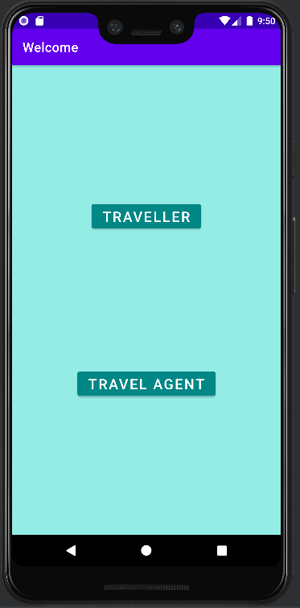

Στην πρώτη που είναι απλός χρήστης, μπαίνει στην εφαρμογή χωρίς διαπιστευτήρια ή τη δημιουργία λογαριασμού. Πρώτη οθόνη, αποτελεί η οθόνη με τους προορισμούς (locations), η εμφάνισή τους γίνεται με τη χρήση ενός recyclerview.

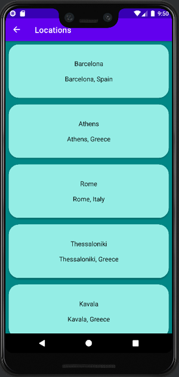

Επιλέγοντας ο χρήστης έναν προορισμό, τον οδηγεί στα πακέτα που αφορούν τη συγκεκριμένη τοποθεσία. Η εμφάνιση των πακέτων γίνεται επίσης με τη χρήση recyclerview, και στις δύο περιπτώσεις η δομή του κάθε item που πρόκειται να εμφανιστεί στο recycler view αποτελείται από έναν τίτλο και μία περιγραφή. Στην περίπτωση της τοποθεσία, τίτλος είναι η πόλη και περιγραφή η πόλη μαζί με την χώρα, ενώ στην περίπτωση του πακέτου τίτλος είναι η πόλη και χώρα, με περιγραφή (την διάρκεια σε ημέρες, τον τύπο της εκδρομής και) την τιμή του πακέτου. 

todo()

Πατώντας και επιλέγοντας ένα πακέτο, στην επόμενη οθόνη μπορεί να δει αναλυτικά τις πληροφορίες του πακέτου και είτε να πατήσει το κουμπί Book για να προχωρήσει σε κράτηση είτε να επιστρέψει στα πακέτα και να επιλέξει κάποιο άλλο.


Εφόσον ο χρήστης επιλέξει να προχωρήσει σε κράτηση του πακέτου, τον οδηγεί σε μία οθόνη όπου του ζητούνται να συμπληρώσει τα στοιχεία του, Ονοματεπώνυμο, email, τηλέφωνο και προτίμηση Ξενοδοχείου. Σε περίπτωση που ο χρήστης δεν έχει συμπληρώσει σωστά κάποιο στοιχείο (πχ αριθμό τηλεφώνου) ή δεν έχει συμπληρώσει όλα τα πεδία, του βγάζει μήνυμα με Toast, ότι δεν είναι σωστά τα στοιχεία και να ξαναπροσπαθήσει. Εφόσον τα στοιχεία είναι συμπληρωμένα και σωστά, του βγάζει Toast μήνυμα ότι η κράτησή του έγινε με επιτυχία και τον οδηγεί ξανά στην οθόνη των προορισμών ώστε αν επιθυμεί να προχωρήσει και σε άλλη κράτηση.

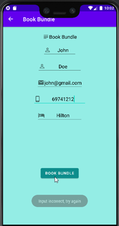 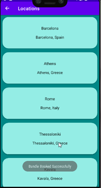

Στην αρχική οθόνη, ο χρήστης μπορεί να επιλέξει ότι είναι Travel Agent και τον οδηγεί στην οθόνη Login για να συμπληρώσει τα στοιχεία του είτε να κάνει Register.

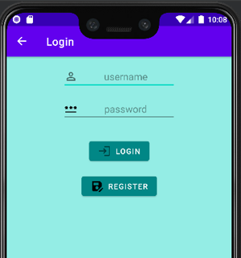

Στην περίπτωση που ο χρήστης δεν συμπληρώσει και το username και το password, του εμφανίζει μήνυμα Toast, ότι πρέπει να συμπληρώσει όλα τα στοιχεία.

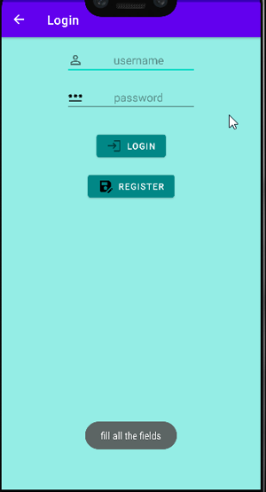 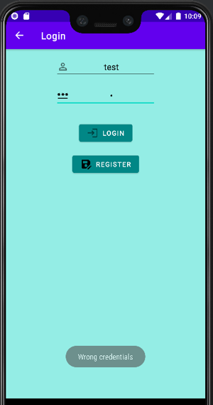

Στην περίπτωση που τα στοιχεία δεν είναι σωστά, εμφανίζεται Toast μήνυμα που του λέει ότι έχει βάλει λάθος στοιχεία. Αν ο χρήστης πατήσει Register τον πηγαίνει σε επόμενη οθόνη όπου του ζητούνται στοιχεία για να κάνει εγγραφή. Πέρα από τα hints που υπάρχουν στην οθόνη ώστε να καταλάβει ο χρήστης πώς περιμένουμε να συμπληρώσει τα στοιχεία, στο πεδίο του Agency name υπάρχει onClickListener που του υποδεικνύει ότι το όνομα πρέπει να ξεκινάει με κεφαλαίο. Αν ο χρήστης πατήσει Register χωρίς να έχει συμπληρώσει όλα τα πεδία του βγάζει μήνυμα να συμπληρώσει όλα τα στοιχεία.

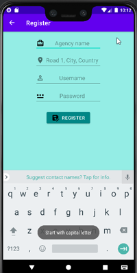 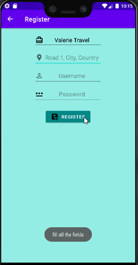

Εφόσον συμπληρώσει σωστά όλα τα στοιχεία και πατήσει Register τον κάνει απευθείας login και τον οδηγεί στο περιβάλλον του travel agent. Εδώ ξεκινάει το δεύτερο activity με όνομα  LoginActivity. Σε αυτό ακριβώς το σημείο οδηγείται και από την προηγούμενη οθόνη αν πατήσει σωστά στοιχεία και κάνει Login αντί για Register. Ουσιαστικά, το 2ο activity ξεκινάει μόλις γίνει είσοδος του χρήστη με επιτυχία.

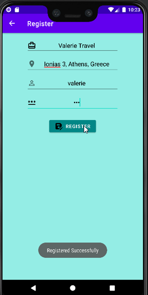

Στην εικόνα που ακολουθεί, βλέπουμε το design του Navigation.xml που περιγράφει τον τρόπο με τον οποίο περιηγείται ο χρήστης στο πρώτο activity, σαν επισκέπτης.

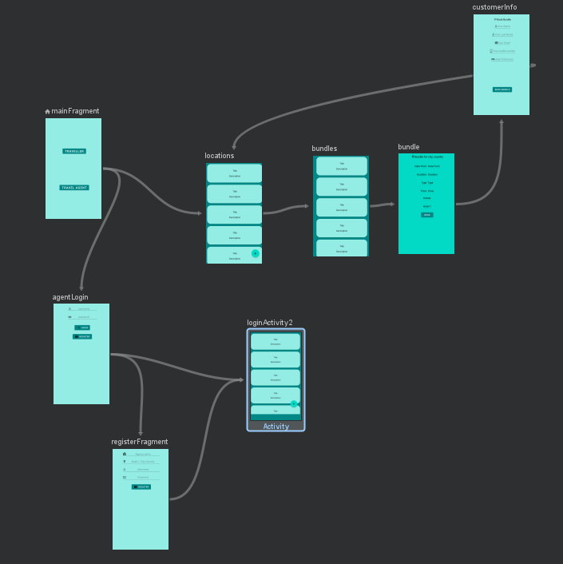

Η πρώτη οθόνη στην οποία οδηγείται ο agent, είναι η σελίδα με τις τοποθεσίες και εκεί όπως είπαμε, ξεκινάει το δεύτερο activity. Εδώ ο χρήστης, έχει και την εμφάνιση μενού (bottom menu), με τις επιλογές Locations (τοποθεσίες), Bundles (πακέτα), Bookings (Κρατήσεις) και Profile (Προφίλ). Στην πρώτη οθόνη βλέπει τη λίστα με όλες τις τοποθεσίες που υπάρχουν διαθέσιμες. Γίνεται χρήση πάλι του fragment_locations_list, είναι το ίδιο που εμφανίζεται και στον απλό χρήστη, με τη διαφορά ότι εδώ εμφανίζεται κάτω δεξιά ένα floating button για προσθήκη τοποθεσίας. Με την αρχικοποίηση του fragment γίνεται έλεγχος αν ο χρήστης είναι συνδεδεμένος (isLoggedIn()) ώστε να αλλάξει το visibility του κουμπιού σε Visible.

Αν το πατήσει, τον οδηγεί σε νέα οθόνη με σκοπό να δημιουργήσει νέα τοποθεσία.

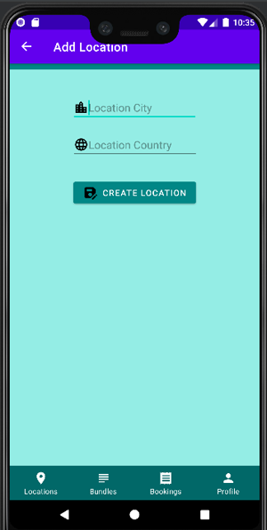

